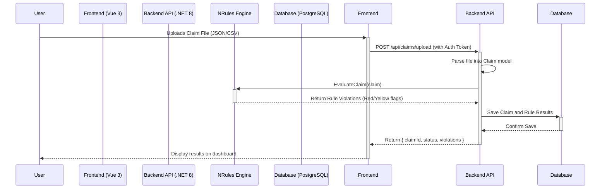

# ClaimGuard AI: MVP Technical Plan

This document outlines the technical architecture and implementation plan for the ClaimGuard AI MVP.

## 1. Goal

Build a SaaS application that analyzes medical claims before submission, flags potential denials using a configurable rules engine, and offers actionable suggestions to improve claim accuracy.

## 2. Core Technology Stack

- **Backend:** .NET 8 Web API with NRules
- **Frontend:** Vue 3 with Vuetify
- **Database:** PostgreSQL
- **Authentication:** Auth0
- **Hosting:** Azure App Service (with a plan to migrate to Docker + AKS for future scaling)

## 3. System Architecture

The system is designed as a modern web application with a decoupled frontend and backend, hosted on Azure.

- **Frontend:** A Vue 3 Single-Page Application (SPA) using Vuetify for its UI component library. It will be hosted as a static site on Azure App Service.
- **Backend:** A .NET 8 Web API responsible for business logic, claim processing, and data access. It will run on Azure App Service.
- **Database:** A PostgreSQL database, hosted on Azure Database for PostgreSQL, will store all application data.
- **Identity:** Auth0 will manage user authentication and authorization, securing the backend API.
- **Rules Engine:** NRules is integrated directly into the .NET backend to evaluate claims.

### Architectural Diagrams

**System Context Diagram (C1)**
```mermaid
graph TD
    subgraph "ClaimGuard AI System"
        A[Frontend SPA <br> (Vue 3 + Vuetify on App Service)]
        B[Backend API <br> (.NET 8 + NRules on App Service)]
        C[Database <br> (PostgreSQL on Azure)]
    end

    User(Healthcare Biller) -- "Manages Claims via Browser" --> A
    A -- "Makes API Calls (HTTPS)" --> B
    B -- "Authenticates via Token" --> Auth0(Auth0 <br> Identity Platform)
    User -- "Logs In" --> Auth0
    B -- "Reads/Writes Data" --> C

    style User fill:#00a8ff,stroke:#333,stroke-width:2px
    style Auth0 fill:#eb5424,stroke:#333,stroke-width:2px
```

**Claim Processing Sequence Diagram**


## 4. Core Data Models (PostgreSQL Schema)

```sql
-- Users are managed by Auth0; we only store a reference if needed.
-- We will primarily use the user_id from the JWT token.

CREATE TABLE Claims (
    ClaimId SERIAL PRIMARY KEY,
    BatchId UUID NOT-NULL,
    PayerId VARCHAR(100) NOT NULL,
    ProviderId VARCHAR(100) NOT NULL,
    PatientId VARCHAR(100) NOT NULL,
    DateOfService DATE NOT NULL,
    TotalCharges DECIMAL(18, 2) NOT NULL,
    SubmissionStatus VARCHAR(50) NOT NULL, -- e.g., 'Pending', 'Validated', 'Error'
    UploadedBy VARCHAR(255) NOT NULL, -- User ID from Auth0
    UploadedAt TIMESTAMPTZ DEFAULT CURRENT_TIMESTAMP
);

CREATE TABLE ServiceLines (
    ServiceLineId SERIAL PRIMARY KEY,
    ClaimId INT NOT NULL REFERENCES Claims(ClaimId),

    -- Core Service Line Details
    ServiceDate DATE NOT NULL,
    PlaceOfService VARCHAR(2) NOT NULL,
    CPTCode VARCHAR(10) NOT NULL,
    Modifiers VARCHAR(10)[], -- Array for one or more modifiers
    RevenueCode VARCHAR(10),
    Units INT NOT NULL DEFAULT 1,
    ChargeAmount DECIMAL(18, 2) NOT NULL,

    -- Diagnosis and Provider
    DiagnosisPointers VARCHAR(2)[] NOT NULL, -- Points to the diagnosis on the claim header
    RenderingProviderNPI VARCHAR(10),

    -- Rule & Policy Support
    PriorAuthIndicator BOOLEAN,
    CoverageIndicator BOOLEAN,
    PayerPolicyGroupId VARCHAR(100),
    ProcedureType VARCHAR(50) -- e.g., 'Surgery', 'Lab', 'Diagnostic'
);

CREATE TABLE RuleViolations (
    ViolationId SERIAL PRIMARY KEY,
    ClaimId INT REFERENCES Claims(ClaimId),
    RuleName VARCHAR(255) NOT NULL,
    Severity VARCHAR(20) NOT NULL, -- 'Red' (Block) or 'Yellow' (Warning)
    Message TEXT NOT NULL,
    TriggeredAt TIMESTAMPTZ DEFAULT CURRENT_TIMESTAMP
);

-- For the Admin UI (Stretch Goal)
CREATE TABLE Rules (
    RuleId SERIAL PRIMARY KEY,
    RuleName VARCHAR(255) UNIQUE NOT NULL,
    Description TEXT,
    IsEnabled BOOLEAN DEFAULT TRUE,
    MessageTemplate TEXT
);
```

## 5. API Endpoint Specification (MVP)

- `POST /api/claims/upload`: Accepts a file (JSON/CSV), parses it, runs it through the rules engine, and saves the results.
- `GET /api/claims`: Retrieves a paginated list of all claims. Supports filtering by `payerId`, `status`, etc.
- `GET /api/claims/{claimId}`: Retrieves the full details of a single claim, including its service lines and any rule violations.
- `GET /api/dashboard/summary`: Retrieves summary statistics for the dashboard.

## 6. MVP Milestones

- **Week 1: Foundation & Setup**
  - Scaffold .NET 8 Web API and Vue 3 projects.
  - Set up PostgreSQL database on Azure.
  - Configure Auth0 and integrate login/logout with the Vue app and secure the .NET API.
  - Define and implement core models using Entity Framework Core.

- **Week 2: Core Logic & First Rule**
  - Implement the `ClaimParser` service for JSON-based claim uploads.
  - Bootstrap the NRules engine within the `RuleEngineService`.
  - Implement the first rule: **Eligibility Verification**.
  - Create the `POST /api/claims/upload` endpoint.

- **Week 3: Building the UI**
  - Develop the Vue/Vuetify file upload interface.
  - Create the main dashboard view to display a list of recent claims.
  - Build the claim detail view to show violations.

- **Week 4: Expanding Rules & Logging**
  - Implement two more rules: **Modifier Presence** and **Duplicate Detection**.
  - Implement the `RuleViolations` logging to the database.
  - Refine the UI to clearly display red/yellow flags and violation messages.

- **Week 5: Polish, Test & Deploy**
  - Write unit tests for all implemented rules and services.
  - Conduct end-to-end integration testing.
  - Prepare and execute deployment scripts for Azure App Service.
